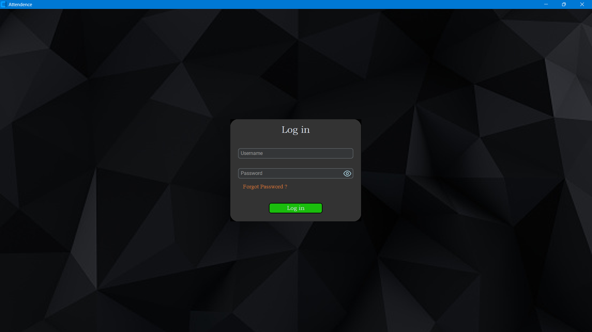

# Attendance-Management-Software

Attendance-Management-Software is a desktop application developed in Python for managing attendance sheets in Excel. The main modules used in this program are Tkinter, openpyxl, and pydrive.



`documentation_images/Example_1.png`

## Features
- Manage attendance sheets in Excel format
- Add or remove students from the attendance list
- Keep track of student attendance on a daily basis
- Store attendance data securely in Google Drive using pydrive
- Easy to use and user-friendly interface

## Future Enhancements
As this is the developer's first big project, the Attendance-Management-Software lacks some features that can be added in future updates. Some of the possible enhancements are:
- Automatic calculation of attendance percentages and grades
- Email notifications for absentees or latecomers
- Generating reports and charts for attendance data analysis
- Improving the user interface and user experience to make the software more intuitive and user-friendly
- Adding error handling and logging features to make it easier to debug and troubleshoot any issues that may arise


`documentation_images/Example_2.png`


## Installation
#### Attendance-Management-System Setup Guide

To set up the Attendance-Management-System, follow the steps below:

1. Download the repository [`Attendance-Management-System`](https://github.com/EnthusiasticXcoder/Attendence-Management-Software.git).

2. Setup Google Drive API and Create Client_secret.json file.

3. Set Up OAuth 2.0 Credentials.

4. Copy the  Client_secreat.json, credentials.json and settings.yaml files to the main folder.

Note: Please refer to the official documentation of [PyDrive](https://pythonhosted.org/PyDrive/) and [Google Drive API](https://developers.google.com/drive) for more information.

Once you have completed these steps, you should have the Attendance-Management-System set up and ready to use.

To Create Login Credentials for Login run `Logincredentials.py` file or execute the following command:

```shell
python Logincredentials.py
```

To run Attendence Software, execute the following command:

```shell
python MyApp/maincode.py
```

Feel free to reach out if you have any questions or need further assistance.

## Contributors
Attendance-Management-Software is developed by Anshul Verma. If you would like to contribute to this project, please feel free to submit a pull request.

## License
Attendance-Management-Software is licensed under the [MIT License](LICENSE). See the LICENSE file for more details.
